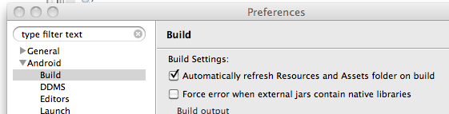

= Download

This page explains how to get and use BridJ using various build management systems and provides platform-specific notes.

http://jnaerator.sourceforge.net/webstart/JNAerator/JNAeratorStudio.jnlp[You can try BridJ quickly] through http://jnaerator.googlecode.com/[JNAerator] (just select "BridJ" in the "Runtime" combobox).

== Get BridJ

It is advised to use Maven or sbt to manage dependencies automatically.

=== Direct downloads

  * Latest release: http://search.maven.org/#artifactdetails%7Ccom.nativelibs4java%7Cbridj%7C0.7.0%7Cbundle[0.7.0]
  * Latest snapshot: https://oss.sonatype.org/content/groups/public/com/nativelibs4java/bridj/0.7-SNAPSHOT/[0.7-SNAPSHOT]

=== Use with Maven

New releases are deployed on http://search.maven.org/[Maven Central], so you don't need to declare any repository:
[source,xml]
----
<dependencies>
  <dependency>
	<groupId>com.nativelibs4java</groupId>
	<artifactId>bridj</artifactId>
	<version>0.7.0</version>
  </dependency>
</dependencies>
----

If you wish to use a snapshot:

[source,xml]
----
<repositories>
  <repository>
    <id>sonatype</id>
    <name>Sonatype OSS Snapshots Repository</name>
    <url>http://oss.sonatype.org/content/groups/public</url>
  </repository>
  <repository>
    <id>nativelibs4java-repo</id>
    <name>NativeLibs4Java Old Snapshots Repository</name>
    <url>http://nativelibs4java.sourceforge.net/maven</url>
  </repository>
</repositories>
<dependencies>
  <dependency>
	<groupId>com.nativelibs4java</groupId>
	<artifactId>bridj</artifactId>
	<version>0.7-SNAPSHOT</version>
  </dependency>
</dependencies>
----

=== Use with sbt

[source,scala]
----
import sbt._

class Project(info: ProjectInfo) extends DefaultProject(info)
{
  // Repository for snapshots (0.6.2-SNAPSHOT onwards)
  // val sonatypeSnapshotsRepo = "Sonatype OSS Snapshots Repository" at "http://oss.sonatype.org/content/groups/public"
  // Repository for old releases <= 0.6
  // val nativelibs4javaRepo = "NativeLibs4Java Repository" at "http://nativelibs4java.sourceforge.net/maven/"
  val bridj = "com.nativelibs4java" % "bridj" % "0.7.0"
}
----

=== Specialized subsets (smaller JARs !)

If BridJ is too heavy for you, there are pre-packaged specialized subsets of BridJ.

You can download them manually from the http://repo1.maven.org/maven2/com/nativelibs4java/bridj/0.7.0/[Maven repository] or specify the correct _classifier_ in the Maven dependency (cf. next section).

==== List of prepackaged subsets

|===
|Maven Classifier | C | C++ | Objective-C | COM | .NET | Windows (x86, x64) | MacOS X (universal) | iOS (arm) | Linux (x86, x64) | Solaris (x86) | Android (arm)

|_empty_
| x
| x
| x
| x
| x
| x
| x
| x
| x
| x
| -

|`c-only`
| x
| -
| -
| -
| -
| x
| x
| x
| x
| x
| -

|`windows-only`
| x
| x
| -
| x
| x
| x
| -
| -
| -
| -
| -

|`unix-only`
| x
| x
| x
| -
| -
| -
| x
| x
| x
| x
| -

|`linux-only`
| x
| x
| -
| -
| -
| -
| -
| -
| x
| -
| -

|`macosx-only`
| x
| x
| x
| -
| -
| -
| x
| -
| -
| -
| -

|`ios-only`
| x
| x
| x
| -
| -
| -
| -
| x
| -
| -
| -

|`android`
| x
| x
| -
| -
| -
| -
| -
| -
| -
| -
| x
|===

==== Build your own subset

Note that you can use the http://maven.apache.org/plugins/maven-shade-plugin/[Maven Shade Plugin] in your own
Maven project to strip away native libraries (in the `org/bridj/lib/\*` packages) and classes (such as COM support in `org/bridj/cpp/com/*`) that you don't need.

Take https://github.com/ochafik/nativelibs4java/tree/master/libraries/Runtime/BridJ/pom.xml[BridJ's pom] as example.

== Platform notes

=== Android

BridJ works partially on Android/arm emulators (with the http://developer.android.com/sdk/index.html[SDK]), and probably even on actual devices (untested).

Proper C++ support might require that you compile your native library with the Android NDK r5 (or more recent) or with http://www.crystax.net/android/ndk-r5.php[CrystaX's NDK], as BridJ makes some use of RTTI.

See http://code.google.com/p/nativelibs4java/issues/detail?id=69[this issue] for progress info.

==== Including BridJ in a project

To include BridJ to an Android project, you have two options:

* Using the Android SDK Eclipse plugin :
  - add `bridj-x.x-android.jar` to your project's classpath
  - make sure to untick the "Force error when external jars contain native libraries" checkbox in the Eclipse / Android / Build preferences (otherwise it will complain that "The library x contains native libraries that will not run on the device.")
  

WARNING: http://code.google.com/p/android/issues/detail?id=17861[this setting is broken] in the current version of the plugin, so as a workaround you'll have to also untick the "Automatically refresh resources and assets folder on build" checkbox... Annoying ? Please let the Android devs know about it ;-)

* Command-line :
  - build your native library with the http://developer.android.com/sdk/ndk/index.html[NDK]
  - use an ant-based project (see sample below).
  - create the `lib` directory and put `bridj-x.x-android.jar` inside it (add any other JAR dependency there)
  - add the line `jar.libs.dir=lib` to the `build.properties` file : BridJ will be in the classpath and will be included in your program.

==== Sample of BridJ on Android

A simple sample of BridJ use on Android was derived from the NDK's `helloworld-jni` sample. It is https://github.com/ochafik/nativelibs4java/tree/master/libraries/Runtime/BridJ/src/main/cpp/android-test/[available in BridJ's SVN repository].

Building upon the NDK's `helloworld-jni` sample, you can modify the helloworld.c file as follows :
[source,c++]
----
#include <string.h>
#include <jni.h>

jstring Java_com_example_hellojni_HelloJni_stringFromJNI( JNIEnv* env, jobject thiz ) {
    return (*env)->NewStringUTF(env, "Hello from JNI !");
}

int addTwoInts(int a, int b) {
        return a + b;
}
----
And add the following BridJ bindings :

[source,java]
----
package com.example.hellojni;

import org.bridj.*;
import org.bridj.ann.*;

@Library("hello-jni")
public class BridJLib {
        static {
                BridJ.register();
        }
        public static native int addTwoInts(int a, int b);
}
----

You will then be able to use BridJ transparently in your activities :

[source,java]
----
TextView  tv = new TextView(this);
int a = 10, b = 100;
tv.setText(a + " + " + b + " = " + BridJLib.addTwoInts(a, b) + " (computed in BridJ-bound native function !)");
----

=== Windows

C, C++, COM support is ok.

`.NET` support is non-existent.

=== Linux

C, C++ support is ok.

=== Solaris

Only Solaris x86 is supported (test hardware would be welcome !).

C, C++ support is ok, with some issues in endianness-aware reading/writing with Pointer.

=== MacOS X

C, C++ support is ok.

Objective-C support is dramatically undertested and probably very poor. Help would be appreciated...

=== iOS (jailbroken iPhones and iPads)

BridJ's support for iOS is not working properly yet, and relies on http://jamvm.sourceforge.net/[JamVM].
